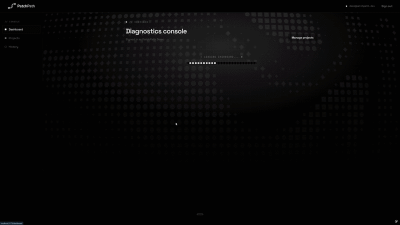

# PatchPath

**Find the root cause. Follow the fix. Ship with confidence.**

PatchPath helps developers understand why an app works locally but fails in
production. You upload logs, config files, Dockerfiles, package manifests, or
pasted error text; PatchPath extracts evidence, detects known deployment failure
patterns, and produces a careful, evidence-backed root-cause report — with fix
recommendations and verification steps, and **without ever claiming certainty**.




---

## Problem

Production deployment failures are noisy and platform-specific. A missing
environment variable, a wrong start command, or a pruned dependency surfaces as a
wall of logs that looks different on Vercel, Render, Railway, and Docker. Junior
and mid-level developers lose hours pattern-matching by hand.

## What PatchPath does

- Accepts deployment evidence (files + pasted errors) tied to a project.
- **Redacts secrets** before anything is stored or sent to a model.
- Runs a **deterministic rule detector** for known failure patterns.
- Builds a compact **evidence bundle** (never the raw, unbounded logs).
- Asks an LLM for a **schema-validated** diagnosis, with confidence **capped by
  evidence quality**.
- Persists every report so past debugging sessions stay revisitable.

## Demo workflow

`Landing → Register/Login → Dashboard → Create project → New analysis →
Upload evidence → Analyze → Diagnosis report → History`

See [docs/DEMO_SCRIPT.md](docs/DEMO_SCRIPT.md) for the full recruiter walkthrough.

## Tech stack

| Layer | Choice |
| --- | --- |
| Frontend | React + Vite + TypeScript |
| Backend | Django + Django REST Framework |
| Database | PostgreSQL |
| Auth | Email/password with JWT (`djangorestframework-simplejwt`) |
| AI | OpenAI-compatible API with structured JSON output (validated by Pydantic) |
| Local dev | Docker Compose (frontend + backend + db) |

## Architecture

See [docs/ARCHITECTURE.md](docs/ARCHITECTURE.md) for diagrams and the full
breakdown. The headline idea is an **evidence-first AI pipeline**:

```
upload → redact → rule detection → evidence bundle → AI (schema-validated) → report
```

Deterministic detection and redaction run *before* the model, and model output is
validated and confidence-capped *before* it is saved.

## Project structure

```
PatchPath/
├── backend/            # Django project + DRF API
│   ├── config/         #   split settings, urls, wsgi/asgi, health check
│   └── apps/
│       ├── accounts/   #   custom email user + JWT auth
│       └── diagnostics/#   domain models, API, detector, report pipeline
├── frontend/           # React + Vite + TypeScript SPA
├── docs/               # plan, architecture, API, demo script
├── samples/            # safe demo evidence files
├── docker-compose.yml  # local orchestration
└── Makefile            # developer shortcuts
```

## Local setup

### Option A — Docker (recommended)

```bash
cp backend/.env.example backend/.env      # then edit secrets
cp frontend/.env.example frontend/.env
make up                                    # db + backend + frontend
```

- API: http://localhost:8000/api/health/
- Frontend: http://localhost:5173

Seed the recruiter demo once the containers are healthy:

```bash
make seed
```

Demo login: `demo@patchpath.dev` / `PatchPathDemo123!`.

### Option B — run services directly

```bash
# Backend
cd backend
python -m venv .venv && source .venv/bin/activate   # Windows: .venv\Scripts\activate
pip install -r requirements.txt
cp .env.example .env
python manage.py migrate
python manage.py runserver

# Frontend (separate terminal)
cd frontend
npm install
cp .env.example .env
npm run dev
```

## Environment variables

Backend variables are documented in [backend/.env.example](backend/.env.example)
(Django, database, JWT, CORS, AI, upload limits). The frontend reads
`VITE_API_BASE_URL` from [frontend/.env.example](frontend/.env.example).

Leave `OPENAI_API_KEY` blank for the seeded offline demo. Live `Analyze` runs
still require an OpenAI-compatible key because the final report is model-backed.

## Running tests

```bash
make test            # or: cd backend && pytest
make test-cov        # with coverage
```

The AI client is always mocked in tests — the suite never reaches the network.

## Supported issue patterns

The detector targets 13+ deployment failure classes, including missing
environment variables / `DATABASE_URL`, port-binding mistakes, missing Python/Node
dependencies, npm build failures, CORS errors, Django staticfiles/collectstatic
issues, Postgres connection refusals, Docker build failures, wrong start commands,
and Vercel/Render/Railway config mismatches. Full list in
[docs/AGENT_PLAN.md](docs/AGENT_PLAN.md) §10.

## AI safety & security notes

- The model only ever sees **redacted, extracted evidence** — never raw uploads.
- Output is **schema-validated**; references to unknown files are rejected and retried.
- **Confidence is capped** by evidence quality and **never reaches 100%**.
- Every report **must** surface missing information and verification steps.
- Uploads are **text-only, size-limited, redacted, and never executed**.
- All diagnostic data is **scoped to the authenticated owner**.

## Project status

PatchPath has the MVP vertical slice implemented: auth, project/session APIs,
secure text uploads, rule detection, evidence bundles, schema-validated AI
reports, report history, a React workflow, and seeded demo data. Current Phase 8
work focuses on fresh-clone reliability, demo polish, smoke testing, and keeping
docs aligned with the implementation.

## Roadmap

GitHub import · background analysis jobs (Celery/Redis) · shareable reports ·
optional PR suggestions behind safety controls · cloud object storage.

## Recruiter highlights

- Full-stack AI product: React, Django REST Framework, PostgreSQL, Docker.
- Evidence-first design that measurably **reduces hallucination risk**.
- Production-minded from day one: split settings, throttling, ownership scoping,
  secret redaction, schema validation, and a test strategy that mocks the model.
- AI coding assistants were used for scaffolding, debugging, refactoring, and
  review; I designed the architecture, validated the logic, tested the app, and
  handled deployment.
