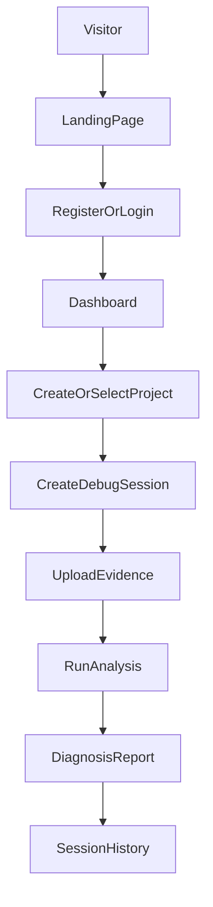
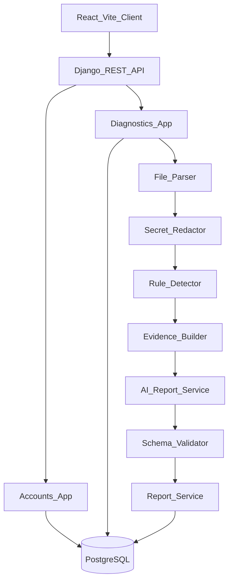
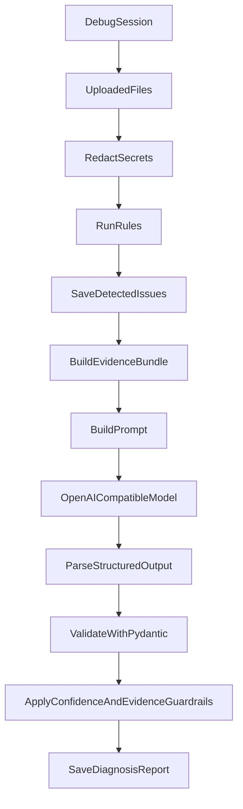

# PatchPath Development Plan

## Planning Assumptions

PatchPath is a greenfield full-stack SaaS MVP. The workspace is currently empty, so the implementation should create a clean monorepo instead of adapting an existing app.

Chosen MVP stack:

- Frontend: React + Vite + TypeScript
- Backend: Django + Django REST Framework
- Database: PostgreSQL
- Auth: email/password with JWT using `djangorestframework-simplejwt`
- AI: OpenAI-compatible API with structured JSON output
- File storage: text content stored in PostgreSQL for MVP, with strict size/type limits
- Background jobs: synchronous analysis for MVP, Celery/Redis deferred
- Local deployment: Docker Compose with frontend, backend, and PostgreSQL

Installed/relevant skills applied to this plan:

- `frontend-design`: distinctive SaaS/devtool visual direction
- `vercel-react-best-practices`: React component, data fetching, bundle, and rerender discipline
- `django-patterns`: split settings, service layer, DRF viewsets, queryset optimization
- `django-security`: auth, authorization, file upload validation, throttling, secure settings
- `django-tdd`: pytest, factories, API tests, mocked AI calls
- `docker-patterns`: local Compose, service networking, pinned images, non-root containers
- `deployment-patterns`: health checks, env validation, production readiness
- `postgresql-table-design`: constraints, FK indexes, JSONB usage, timestamp choices
- `structured-output-extractor`: schema-first AI output validation and retry behavior
- `indexion-readme`: README and docs construction discipline

## 1. Product Overview

PatchPath helps developers understand why an app works locally but fails in production. Users upload logs, config files, Dockerfiles, package files, environment examples, or pasted error messages. PatchPath extracts evidence, detects known deployment failure patterns, and generates a careful root-cause report with fix recommendations and verification steps.

Positioning:

- Product name: PatchPath
- Tagline: Find the root cause. Follow the fix. Ship with confidence.
- Target users: junior-to-mid developers, bootcamp grads, indie hackers, and teams deploying to Vercel, Render, Railway, AWS, or Docker-based environments
- Product promise: turn noisy deployment failures into a clear evidence-backed path to resolution
- Trust promise: PatchPath never presents AI output as certain, never hides missing information, and never auto-applies fixes in the MVP

The product should feel like a real devtool SaaS. The UX should resemble a diagnostic console more than a generic CRUD dashboard: evidence, status, confidence, severity, and next actions are core interface objects.

## 2. MVP Scope

MVP includes:

- Landing page with product narrative and demo-ready flow
- Register, login, logout, and current-user session restoration
- Dashboard with project/session/report summaries
- Project creation with stack and cloud provider metadata
- Project detail with recent sessions
- New analysis flow with file upload and pasted error text
- Text parsing for `.log`, `.txt`, `.env.example`, `.json`, `.yaml`, `.yml`, `.toml`, `.ini`, `.cfg`, `.conf`, `.py`, `.js`, `.ts`, `.tsx`, `Dockerfile`, `Procfile`, `package.json`, and requirements files
- Rule-based detector for the known MVP deployment issues
- Evidence bundle construction from detected snippets
- Structured AI report generation from evidence only
- Persistent reports and previous debugging sessions
- Report page showing root cause, confidence, severity, evidence, recommended fix, commands, verification checklist, missing information, and risks
- Docker-ready local development
- Focused backend tests for auth, permissions, uploads, rule detection, report generation, and AI validation failure modes

Explicitly deferred:

- GitHub integration
- Automatic code patches, commits, or PRs
- Team accounts, billing, organizations, roles
- Background analysis jobs with Celery/Redis
- Cloud object storage
- Live log streaming
- Browser extension or CLI uploader
- Production observability integrations

## 3. User Journey

Primary workflow:



Product states to support:

- Empty dashboard: prompt user to create first project
- Empty project: prompt user to start first analysis
- Upload ready: show accepted file types and size limits
- Upload validation error: explain rejected file precisely
- Analyzing: show deterministic detection and AI diagnosis as separate steps
- No evidence found: show low-confidence report with missing information
- AI unavailable: save session as failed and keep detected issues visible
- Completed report: show conclusion, evidence, fix path, and verification checklist

## 4. Architecture

Runtime architecture:



Repository layout:

- [frontend](frontend): React/Vite TypeScript app
- [backend](backend): Django project and DRF API
- [docs](docs): agent handoff plan, demo script, sample reports, architecture notes
- [samples](samples): safe sample logs/config files for demo uploads
- [docker-compose.yml](docker-compose.yml): local orchestration
- [README.md](README.md): recruiter-facing project documentation

Backend architecture principles:

- Use split settings: `base.py`, `development.py`, `test.py`, `production.py`
- Keep API views thin and move business logic into services
- Use custom email-based user model from the start
- Use ownership-scoped querysets for every project/session/report endpoint
- Use PostgreSQL as the source of truth for MVP uploads and reports
- Use transactions around analysis so session status and report persistence stay consistent
- Mock AI calls in tests

Frontend architecture principles:

- Keep route components responsible for page composition and data orchestration
- Keep reusable UI pieces in `components`
- Keep API calls in typed client modules
- Avoid broad barrel imports
- Use `Promise.all` for independent dashboard/project fetches
- Use memoization only around genuinely expensive derived report rendering
- Keep localStorage minimal: auth token and maybe user preference only

## 5. Backend Folder Structure

Target structure:

```text
backend/
  manage.py
  requirements.txt
  pytest.ini
  .env.example
  Dockerfile
  config/
    __init__.py
    urls.py
    wsgi.py
    asgi.py
    settings/
      __init__.py
      base.py
      development.py
      test.py
      production.py
  apps/
    accounts/
      __init__.py
      apps.py
      models.py
      serializers.py
      views.py
      urls.py
      tests/
        test_auth_api.py
    diagnostics/
      __init__.py
      apps.py
      models.py
      serializers.py
      permissions.py
      views.py
      urls.py
      services/
        file_parser.py
        redaction.py
        rule_definitions.py
        rule_detector.py
        evidence_builder.py
        report_schema.py
        ai_client.py
        report_generator.py
      tests/
        factories.py
        fixtures/
          django_missing_database_url.log
          node_missing_dependency.log
          render_wrong_start_command.log
        test_models.py
        test_permissions.py
        test_uploads.py
        test_rule_detector.py
        test_report_generator.py
        test_sessions_api.py
```

Preferred dependencies:

- `django`
- `djangorestframework`
- `djangorestframework-simplejwt`
- `django-cors-headers`
- `django-environ`
- `psycopg[binary]` or `psycopg2-binary`
- `gunicorn`
- `whitenoise`
- `openai`
- `pydantic`
- `pytest`
- `pytest-django`
- `factory-boy`
- `pytest-cov`

## 6. Frontend Folder Structure

Target structure:

```text
frontend/
  package.json
  vite.config.ts
  tsconfig.json
  Dockerfile
  index.html
  src/
    main.tsx
    App.tsx
    styles/
      globals.css
      tokens.css
    api/
      client.ts
      auth.ts
      dashboard.ts
      projects.ts
      sessions.ts
      reports.ts
    components/
      layout/
        AppShell.tsx
        TopNav.tsx
        Sidebar.tsx
      ui/
        Button.tsx
        Card.tsx
        Input.tsx
        Badge.tsx
        EmptyState.tsx
        LoadingState.tsx
        ErrorState.tsx
      diagnostics/
        FileDropzone.tsx
        UploadedFileList.tsx
        AnalysisTimeline.tsx
        ConfidenceBadge.tsx
        SeverityBadge.tsx
        EvidenceList.tsx
        FixSteps.tsx
        CommandList.tsx
        VerificationChecklist.tsx
        MissingInformation.tsx
        RisksList.tsx
    context/
      AuthContext.tsx
    hooks/
      useAuth.ts
      useAsyncAction.ts
    routes/
      LandingPage.tsx
      LoginPage.tsx
      RegisterPage.tsx
      DashboardPage.tsx
      ProjectsPage.tsx
      ProjectDetailPage.tsx
      NewAnalysisPage.tsx
      SessionHistoryPage.tsx
      ReportPage.tsx
    types/
      api.ts
      diagnostics.ts
    utils/
      format.ts
      severity.ts
```

Frontend design direction:

- Visual identity: deployment forensics console
- Palette: deep navy/black base, subdued slate panels, diagnostic amber for warnings, calm green for verified steps, red only for high-severity failures
- Signature UI element: an evidence trail that looks like a trace through uploaded artifacts, connecting log snippets to rule matches to the final diagnosis
- Typography: use a readable UI sans for body, a mono face for logs/commands/evidence, and a restrained display style on landing page headings
- UX voice: careful, specific, and practical; avoid hype in report text
- Accessibility: visible focus states, semantic buttons/labels, reduced motion support, no color-only severity communication

## 7. Database Schema

Use UUID primary keys in Django models for externally exposed records. This gives opaque IDs in URLs and simplifies future public share links. Use `TIMESTAMPTZ` via Django `DateTimeField` with timezone support.

### `accounts.User`

Custom user model:

- `id`: UUID primary key
- `email`: unique, indexed, required
- `name`: optional text
- `password`: managed by Django
- `is_active`, `is_staff`, `is_superuser`
- `date_joined`

Notes:

- Set `AUTH_USER_MODEL` before first migration
- Use email as `USERNAME_FIELD`
- Normalize email on create
- Enable Django password validators

### `diagnostics.Project`

- `id`: UUID primary key
- `user`: FK to user, `CASCADE`, indexed
- `name`: required text
- `stack`: text, blank allowed
- `cloud_provider`: text, blank allowed
- `created_at`: datetime
- `updated_at`: datetime

Constraints and indexes:

- Index `user`
- Index `-created_at`
- Unique per user on lowercased project name if practical, otherwise validate in serializer

### `diagnostics.DebugSession`

- `id`: UUID primary key
- `project`: FK to project, `CASCADE`, indexed
- `status`: text choices `pending`, `analyzing`, `completed`, `failed`
- `error_summary`: text, blank allowed
- `analysis_started_at`: datetime, nullable
- `analysis_completed_at`: datetime, nullable
- `failure_reason`: text, blank allowed
- `created_at`: datetime
- `updated_at`: datetime

Indexes:

- `project`
- `status`
- `-created_at`
- composite `(project, -created_at)`

### `diagnostics.UploadedFile`

- `id`: UUID primary key
- `debug_session`: FK to session, `CASCADE`, indexed
- `filename`: text
- `file_type`: text
- `content`: text
- `content_sha256`: text, indexed
- `size_bytes`: positive integer
- `line_count`: positive integer
- `redaction_count`: positive integer default `0`
- `uploaded_at`: datetime

Constraints:

- `size_bytes >= 0`
- `line_count >= 0`
- unique `(debug_session, content_sha256)` to prevent duplicate uploads within a session

### `diagnostics.DetectedIssue`

- `id`: UUID primary key
- `debug_session`: FK to session, `CASCADE`, indexed
- `issue_type`: text
- `severity`: text choices `low`, `medium`, `high`
- `confidence_hint`: float between `0` and `<1`
- `matched_pattern`: text
- `evidence`: JSONField list of evidence objects
- `created_at`: datetime

Indexes:

- `debug_session`
- `issue_type`
- `severity`

### `diagnostics.DiagnosisReport`

- `id`: UUID primary key
- `debug_session`: one-to-one FK to session, `CASCADE`, indexed
- `root_cause`: text
- `confidence_score`: float constrained `>= 0` and `< 1`
- `severity`: text choices `low`, `medium`, `high`
- `detected_stack`: JSONField list
- `detected_cloud_provider`: text
- `explanation`: text
- `evidence_json`: JSONField list
- `recommended_fix`: text
- `commands_json`: JSONField list
- `verification_checklist_json`: JSONField list
- `missing_information_json`: JSONField list
- `possible_risks_json`: JSONField list
- `model_name`: text, blank allowed
- `prompt_tokens`: integer, nullable
- `completion_tokens`: integer, nullable
- `created_at`: datetime

JSONB usage:

- Keep report arrays as JSONField because they are semi-structured and displayed as documents
- Do not use JSONField for core relations like project/session/user
- Add GIN indexes later only if report JSON search becomes a real feature

## 8. API Design

All diagnostic endpoints require authentication. Every object lookup must be scoped through the current user's ownership chain.

### Auth

`POST /api/auth/register/`

Request:

```json
{
  "email": "dev@example.com",
  "name": "Dev User",
  "password": "strong-password"
}
```

Response:

```json
{
  "user": {
    "id": "uuid",
    "email": "dev@example.com",
    "name": "Dev User"
  },
  "access": "jwt",
  "refresh": "jwt"
}
```

`POST /api/auth/login/`

Request:

```json
{
  "email": "dev@example.com",
  "password": "strong-password"
}
```

Response matches register.

`POST /api/auth/refresh/`

- Uses SimpleJWT refresh token

`GET /api/auth/me/`

- Returns current user

### Dashboard

`GET /api/dashboard/`

Response:

```json
{
  "project_count": 2,
  "session_count": 7,
  "completed_session_count": 5,
  "failed_session_count": 1,
  "high_severity_count": 2,
  "recent_sessions": [],
  "recent_reports": []
}
```

### Projects

`GET /api/projects/`

- List current user's projects
- Include lightweight counts: `session_count`, `latest_session_at`

`POST /api/projects/`

Request:

```json
{
  "name": "Django Render API",
  "stack": "Django, PostgreSQL",
  "cloud_provider": "Render"
}
```

`GET /api/projects/{project_id}/`

- Return project detail and recent sessions

### Sessions

`POST /api/projects/{project_id}/sessions/`

Request:

```json
{
  "error_summary": "Deployment fails during database startup"
}
```

`GET /api/sessions/{session_id}/`

- Return session, uploaded files metadata, detected issues, and report summary if present

`POST /api/sessions/{session_id}/upload/`

- Multipart upload with field `files`
- Also support `pasted_text` and `pasted_filename` for direct error messages
- Return uploaded file metadata and validation errors per file

`POST /api/sessions/{session_id}/analyze/`

Synchronous MVP behavior:

- Set status to `analyzing`
- Run redaction, detector, evidence builder, AI report generator
- Save detected issues and report
- Set status to `completed`
- On failure, set status to `failed` with `failure_reason`

Response:

```json
{
  "session_id": "uuid",
  "status": "completed",
  "report_id": "uuid"
}
```

### Reports

`GET /api/reports/{report_id}/`

- Return full diagnosis report
- Include session/project context

## 9. Security And Safety Requirements

Authentication and authorization:

- Use a custom email user model
- Use SimpleJWT for API auth
- Add `IsAuthenticated` globally in DRF
- Scope querysets by `request.user`
- Add object-level ownership checks for project/session/report access

Upload security:

- Accept text-like files only
- Reject binary files by extension and content sniffing
- Limit each file to 1 MB for MVP
- Limit session upload total to 5 MB for MVP
- Store sanitized filename, not user-provided paths
- Count and report redactions
- Never execute uploaded content
- Never serve uploaded content as downloadable executable files in MVP

Secret redaction:

- Redact common API keys, JWTs, database URLs, passwords, tokens, private keys, and `.env` values
- Preserve variable names where useful: `DATABASE_URL=[REDACTED_DATABASE_URL]`
- Redact before AI calls
- Prefer storing redacted content in `UploadedFile.content` for MVP safety

API hardening:

- Add throttles for auth, upload, and analyze endpoints
- Configure CORS only for frontend dev/prod origins
- Use secure production settings: `DEBUG=False`, allowed hosts, secure cookies where applicable, security headers
- Log security-relevant failures without logging secrets or raw uploaded evidence

## 10. Rule-Based Issue Detector Design

Detector contract:

Input:

```json
{
  "project": {
    "stack": "Django, PostgreSQL",
    "cloud_provider": "Render"
  },
  "files": [
    {
      "filename": "deploy.log",
      "file_type": "log",
      "content": "redacted text",
      "line_count": 120
    }
  ]
}
```

Output:

```json
[
  {
    "issue_type": "missing_database_url",
    "severity": "high",
    "confidence_hint": 0.82,
    "matched_pattern": "DATABASE_URL",
    "evidence": [
      {
        "source": "deploy.log",
        "line_or_section": "line 42",
        "snippet": "KeyError: DATABASE_URL",
        "reason": "Deployment log shows the app tried to read DATABASE_URL and failed."
      }
    ]
  }
]
```

Implementation approach:

- Define rules as dataclasses in `rule_definitions.py`
- Compile regexes once at module import
- Rules can inspect file names, content, project stack, and provider
- Evidence snippets should include 2 lines before and after the matched line when useful
- Cap each snippet at 500 characters
- Cap each detected issue at 5 evidence items
- De-duplicate near-identical evidence
- Sort issues by severity and confidence hint

MVP rules:

- `missing_env_var`
  - Patterns: `KeyError`, `ImproperlyConfigured`, `Environment variable .* not set`, `Missing required environment variable`
  - Severity: high
- `missing_database_url`
  - Patterns: `DATABASE_URL`, `dj_database_url`, `No DATABASE_URL`, `KeyError: 'DATABASE_URL'`
  - Severity: high
- `port_binding_issue`
  - Patterns: `No open ports detected`, `bind.*PORT`, hardcoded `localhost`, missing `process.env.PORT`, missing `$PORT`
  - Severity: high
- `missing_python_dependency`
  - Patterns: `ModuleNotFoundError`, `ImportError`, `No module named`
  - Severity: high
- `missing_node_dependency`
  - Patterns: `Cannot find module`, `Module not found`, `ERR_MODULE_NOT_FOUND`
  - Severity: high
- `npm_build_failure`
  - Patterns: `npm ERR!`, `npm run build`, `vite build`, `react-scripts build`, `ELIFECYCLE`
  - Severity: medium/high based on context
- `cors_error`
  - Patterns: `blocked by CORS policy`, `No 'Access-Control-Allow-Origin'`
  - Severity: medium
- `django_staticfiles_issue`
  - Patterns: `STATIC_ROOT`, `STATICFILES_DIRS`, `WhiteNoise`, `staticfiles`
  - Severity: medium
- `postgres_connection_refused`
  - Patterns: `connection refused`, `could not connect to server`, `ECONNREFUSED`, port `5432`
  - Severity: high
- `docker_build_failed`
  - Patterns: `failed to solve`, `executor failed`, `COPY failed`, `RUN .* returned a non-zero code`
  - Severity: high
- `wrong_start_command`
  - Patterns: `Application failed to respond`, `Start command`, `gunicorn: command not found`, `npm start`, `Procfile`
  - Severity: high
- `collectstatic_failed`
  - Patterns: `collectstatic`, `staticfiles`, `Post-processing`, `ValueError: Missing staticfiles`
  - Severity: medium
- `vercel_build_command_issue`
  - Patterns: `Vercel`, `Build Command`, `Output Directory`, `No Output Directory named`
  - Severity: medium
- `render_railway_env_mismatch`
  - Patterns: `Render`, `Railway`, `environment variable`, `service variable`, `shared variable`
  - Severity: medium/high

Detector tests must include:

- One fixture per MVP rule
- Duplicate evidence de-duplication
- Secret redaction before evidence creation
- Provider-specific rules do not trigger on unrelated logs
- Weak/no evidence returns empty issues instead of fabricated issues

## 11. Evidence Bundle Design

The evidence builder converts uploaded files and detected issues into a compact LLM-safe payload.

Evidence bundle fields:

- `project_metadata`
- `uploaded_file_summaries`
- `detected_issues`
- `top_evidence`
- `unmatched_error_lines`
- `known_missing_context`

Rules:

- Never send entire large logs by default
- Include only relevant snippets, filenames, line/section labels, and reasons
- Include a clear note when evidence is weak or incomplete
- Include missing file hints, for example: `settings.py was not uploaded`, `package.json was not uploaded`, `.env.example was not uploaded`
- Keep payload under a configurable character budget, default 12,000 characters

## 12. AI Report Generation Flow

AI flow:



Use a Pydantic schema in `report_schema.py`:

- Required fields must be present
- `confidence_score` must be `>= 0` and `< 1`
- `severity` must be `low`, `medium`, or `high`
- `evidence` must be a non-empty list unless the report is explicitly low confidence
- Arrays must default to empty lists only after validation logic confirms acceptable missing data

Guardrails:

- If no detected issues and little evidence, maximum confidence is `0.35`
- If one strong rule has direct log evidence and config corroboration, maximum confidence is `0.9`
- If the model returns `1.0`, clamp to `0.99` or reject and retry
- If evidence in model output references unknown files, reject and retry
- If recommended fix requires a file not uploaded, add missing information instead of pretending certainty
- Always include at least one missing-information item

Retry behavior:

- First call requests structured JSON
- If JSON parse or schema validation fails, retry once with validation errors
- If retry fails, mark session `failed`, save detected issues, and expose a useful error state

## 13. AI Prompt Design

System prompt:

```text
You are PatchPath, a careful deployment diagnostics assistant. Diagnose production deployment failures using only the provided evidence extracted from uploaded files and logs. Do not invent files, log lines, commands, platforms, or configuration values. Never claim certainty. Use careful language such as "most likely", "based on uploaded evidence", and "possible fix". Always include confidence, evidence, missing information, possible risks, and verification steps. Never auto-apply fixes.
```

User prompt template:

```text
Return only valid JSON matching the provided schema.

Task:
Identify the most likely deployment failure root cause from the evidence bundle.

Project metadata:
{project_metadata_json}

Detected rule matches:
{detected_issues_json}

Evidence bundle:
{evidence_bundle_json}

Required behavior:
- Base every conclusion on provided evidence.
- If evidence is weak or incomplete, lower confidence.
- Include missing information even when confidence is high.
- Do not claim 100% certainty.
- Do not recommend automatic code changes.
- Do not reference files, line numbers, providers, or packages that are not in the evidence.
- Prefer practical fix steps and verification commands.

JSON schema:
{diagnosis_report_json_schema}
```

Expected AI JSON:

```json
{
  "root_cause": "string",
  "confidence_score": 0.82,
  "severity": "high",
  "detected_stack": ["Django", "PostgreSQL"],
  "detected_cloud_provider": "Render",
  "explanation": "string",
  "evidence": [
    {
      "source": "deploy.log",
      "line_or_section": "line 42",
      "reason": "The log shows DATABASE_URL was missing at startup."
    }
  ],
  "recommended_fix": "string",
  "commands_to_run": ["string"],
  "verification_checklist": ["string"],
  "missing_information": ["string"],
  "possible_risks": ["string"]
}
```

## 14. Frontend Pages And UX Contracts

### Landing page

Goal: make PatchPath feel like a real devtool product.

Sections:

- Hero with tagline and upload-to-report narrative
- Three-step workflow: upload evidence, detect patterns, follow the fix
- Supported platforms and issue classes
- Example diagnosis card
- AI safety/trust section
- CTA to create account

### Auth pages

- Simple register/login forms
- Clear validation errors
- Store JWT access/refresh tokens
- On app load, call `/api/auth/me/`
- Redirect authenticated users away from auth pages

### Dashboard

- Recent sessions
- Project count
- Completed/failed analysis counts
- High severity issue count
- Empty state to create first project

### Projects page

- Project cards with stack, provider, session count, latest report severity
- Create project modal or dedicated form

### Project detail

- Project metadata
- Recent sessions
- CTA: new analysis
- Link to history

### New analysis/upload

- Session summary field
- File dropzone
- Pasted error message box
- Upload validation display
- Analyze button disabled until at least one evidence item exists
- Analysis timeline: uploaded, rules detected, AI report generated

### Report page

Priority order:

- Root cause statement with careful language
- Confidence and severity
- Evidence trail
- Recommended fix
- Commands to run
- Verification checklist
- Missing information
- Possible risks
- Detected issues
- Uploaded file summary

### History page

- Filter by project/status/severity
- Show previous sessions and report summaries
- Link back to full report

## 15. Implementation Roadmap

### Phase 0: Documentation foundation

Deliverables:

- [docs/AGENT_PLAN.md](docs/AGENT_PLAN.md) copied from this plan
- [README.md](README.md) skeleton
- [samples](samples) folder plan with sample logs listed

Exit criteria:

- Agents can understand what to build without chat history

### Phase 1: Monorepo foundation

Deliverables:

- [backend](backend) Django project with split settings
- [frontend](frontend) Vite React TypeScript app
- [docker-compose.yml](docker-compose.yml) with `backend`, `frontend`, `db`
- `.env.example` files for backend and frontend
- Basic health endpoint: `GET /api/health/`

Exit criteria:

- Backend starts locally
- Frontend starts locally
- PostgreSQL is reachable from backend
- Health endpoint returns OK

### Phase 2: Auth and permissions

Deliverables:

- Custom user model
- Register/login/refresh/me endpoints
- JWT auth configured
- CORS configured
- Frontend auth context and protected routes
- Auth tests

Exit criteria:

- User can register, log in, refresh session, and access protected dashboard
- Anonymous users cannot access diagnostic endpoints

### Phase 3: Diagnostics domain API

Deliverables:

- Project, DebugSession, UploadedFile, DetectedIssue, DiagnosisReport models
- Serializers and viewsets/API views
- Ownership-scoped querysets
- Dashboard endpoint
- API tests with factories

Exit criteria:

- User can create/list projects
- User can create/list sessions under own project
- User cannot access another user's objects

### Phase 4: Upload and parsing

Deliverables:

- Upload endpoint
- Text file validation
- Pasted error support
- Redaction service
- Uploaded file metadata
- Upload UI

Exit criteria:

- Valid text files are stored redacted
- Invalid/binary/oversized files are rejected with clear errors
- Duplicate uploads are handled predictably

### Phase 5: Rule detector

Deliverables:

- Rule definition registry
- Detector service
- Evidence snippet extraction
- Detector tests for all MVP issue types
- Detected issue persistence
- UI display for detected issues

Exit criteria:

- All MVP rule fixtures trigger expected issue types
- No-evidence fixture produces no fabricated issue
- Secrets are not present in stored evidence

### Phase 6: AI diagnosis

Deliverables:

- Pydantic report schema
- AI client wrapper
- Prompt builder
- Evidence bundle builder
- Report generator service
- Validation, retry, confidence guardrails
- Mocked AI tests

Exit criteria:

- Analyze endpoint saves structured report
- Invalid AI JSON retries once
- Failed AI leaves session failed but preserves uploaded files and detected issues
- Confidence is never `1.0`

### Phase 7: Product frontend

Deliverables:

- Landing page
- Dashboard
- Projects list/detail
- New analysis workflow
- Report page
- Session history
- Responsive styling and accessible UI states

Exit criteria:

- User can complete the full flow in browser
- Report page is recruiter-demo quality
- Loading/error/empty states are implemented

### Phase 8: Demo and documentation

Deliverables:

- Sample demo files
- README
- Demo script
- Architecture diagram
- Local setup instructions
- Troubleshooting guide
- Docker instructions

Exit criteria:

- Fresh clone can run app locally from README
- Recruiter demo can be completed with sample files
- README explains AI safety design clearly

## 16. What To Build First

Build the first vertical slice in this order:

1. Backend foundation with health endpoint and PostgreSQL connection
2. Auth with protected dashboard
3. Project/session models and APIs
4. Upload endpoint and file parsing
5. Three detector rules: missing `DATABASE_URL`, missing dependency, wrong start command
6. Minimal report persistence without AI, using detector-only placeholder report
7. Frontend path from login to project to upload to report
8. Add AI structured report generation after evidence-first flow works

This keeps risk low because the product becomes usable before the AI layer exists.

## 17. Testing Strategy

Backend tests:

- Auth registration/login/me
- Project/session CRUD ownership
- Upload validation and redaction
- Rule detector fixtures
- Evidence bundle character budget
- AI schema validation
- AI retry failure path
- Analyze endpoint success and failure

Frontend tests can remain light for MVP unless time allows:

- API client error handling
- Key formatting utilities
- Optional smoke tests for report rendering

Manual smoke tests:

- Register/login
- Create project
- Upload sample Render/Django missing `DATABASE_URL` log
- Run analysis
- Verify report shows evidence, confidence, missing information, fix steps
- Log out/in and confirm history persists

## 18. Docker And Deployment Readiness

Local Compose services:

- `db`: `postgres:16-alpine`, healthcheck with `pg_isready`
- `backend`: Python 3.12 slim, Django dev server for local, depends on healthy db
- `frontend`: Node 22 alpine, Vite dev server

Docker requirements:

- Pin base image versions
- Use `.dockerignore`
- Keep secrets out of images
- Add backend healthcheck
- Use service DNS names like `db`, not `localhost`, inside containers
- Document common commands in README

Production readiness later:

- Backend served by Gunicorn
- Static files handled by WhiteNoise or platform static hosting
- Frontend built as static assets
- `DEBUG=False`
- CORS restricted
- Health endpoint used by hosting platform
- Environment variables validated at startup

## 19. Risks And AI Mistake Reduction

Risks:

- AI hallucinates root causes
- Confidence appears more certain than evidence supports
- Uploaded files include secrets
- Logs are too large for useful model context
- Users copy commands without understanding risk
- Synchronous AI calls make requests slow
- Rule patterns overmatch unrelated logs

Mitigations:

- Evidence-first pipeline with deterministic rule detection
- Redact before storage and before AI calls
- Store and display the exact evidence used
- Cap confidence based on evidence quality
- Require missing information in every report
- Validate AI JSON and reject unknown evidence references
- Show warnings for destructive commands if ever suggested
- Keep analysis synchronous only for MVP, with clear loading states
- Add fixture tests for false positives and false negatives

## 20. Agent Workstreams

### Agent A: Backend foundation and auth

Owns:

- [backend/config](backend/config)
- [backend/apps/accounts](backend/apps/accounts)
- backend environment files

Tasks:

- Initialize Django/DRF
- Add split settings
- Add custom user model
- Add JWT auth endpoints
- Add CORS and secure settings baseline
- Add auth tests

Dependencies:

- None

Definition of done:

- Auth endpoints pass tests
- Protected endpoint rejects anonymous users

### Agent B: Diagnostics domain API

Owns:

- [backend/apps/diagnostics/models.py](backend/apps/diagnostics/models.py)
- [backend/apps/diagnostics/serializers.py](backend/apps/diagnostics/serializers.py)
- [backend/apps/diagnostics/views.py](backend/apps/diagnostics/views.py)
- [backend/apps/diagnostics/urls.py](backend/apps/diagnostics/urls.py)

Tasks:

- Implement models and migrations
- Implement project/session/report APIs
- Enforce ownership scoping
- Add factories and API tests

Dependencies:

- Agent A auth foundation

Definition of done:

- Users cannot access each other's projects/sessions/reports

### Agent C: Upload, parsing, redaction

Owns:

- [backend/apps/diagnostics/services/file_parser.py](backend/apps/diagnostics/services/file_parser.py)
- [backend/apps/diagnostics/services/redaction.py](backend/apps/diagnostics/services/redaction.py)
- upload endpoint behavior

Tasks:

- Validate extensions, size, text content
- Implement pasted text upload
- Redact secrets
- Store uploaded content and metadata
- Add upload tests

Dependencies:

- Agent B session model

Definition of done:

- Safe text uploads work; invalid uploads are rejected

### Agent D: Rule detector and evidence

Owns:

- [backend/apps/diagnostics/services/rule_definitions.py](backend/apps/diagnostics/services/rule_definitions.py)
- [backend/apps/diagnostics/services/rule_detector.py](backend/apps/diagnostics/services/rule_detector.py)
- [backend/apps/diagnostics/services/evidence_builder.py](backend/apps/diagnostics/services/evidence_builder.py)

Tasks:

- Implement MVP rules
- Extract snippets
- Build evidence bundles
- Add fixture-based tests

Dependencies:

- Agent C parsed uploads

Definition of done:

- All MVP rule fixtures pass

### Agent E: AI report generation

Owns:

- [backend/apps/diagnostics/services/report_schema.py](backend/apps/diagnostics/services/report_schema.py)
- [backend/apps/diagnostics/services/ai_client.py](backend/apps/diagnostics/services/ai_client.py)
- [backend/apps/diagnostics/services/report_generator.py](backend/apps/diagnostics/services/report_generator.py)

Tasks:

- Define Pydantic schema
- Implement prompt builder
- Implement OpenAI-compatible client
- Validate and retry structured output
- Persist reports
- Mock AI tests

Dependencies:

- Agent D evidence bundle

Definition of done:

- Analyze endpoint creates validated report or clean failure state

### Agent F: Frontend app shell and auth

Owns:

- [frontend/src/App.tsx](frontend/src/App.tsx)
- [frontend/src/context](frontend/src/context)
- [frontend/src/api](frontend/src/api)
- auth routes and layout components

Tasks:

- Set up routing
- Implement auth context
- Implement API client
- Build landing/auth/dashboard shell

Dependencies:

- Agent A auth endpoints

Definition of done:

- User can register/login and reach dashboard

### Agent G: Frontend diagnostics workflow

Owns:

- [frontend/src/routes](frontend/src/routes)
- [frontend/src/components/diagnostics](frontend/src/components/diagnostics)
- [frontend/src/types/diagnostics.ts](frontend/src/types/diagnostics.ts)

Tasks:

- Build project pages
- Build new analysis/upload flow
- Build report page
- Build history page
- Add polished empty/loading/error states

Dependencies:

- Agents B through E APIs

Definition of done:

- Full workflow works from browser

### Agent H: Docs, samples, and demo

Owns:

- [README.md](README.md)
- [docs](docs)
- [samples](samples)
- Docker docs

Tasks:

- Add architecture docs
- Add recruiter demo script
- Add sample failure files
- Write README setup and AI safety sections

Dependencies:

- Final endpoint and command names from other agents

Definition of done:

- Fresh developer can run and demo PatchPath from docs

## 21. Resume Bullet Points

Use after implementation:

- Built PatchPath, a full-stack AI deployment diagnostics platform using React, Django REST Framework, PostgreSQL, Docker, and OpenAI-compatible structured outputs.
- Designed an evidence-first diagnosis pipeline that combines deterministic rule detection, secret redaction, schema-validated LLM output, confidence scoring, and saved diagnostic reports.
- Implemented authenticated project/session workflows, secure text upload parsing, deployment issue detection, report history, and recruiter-ready demo data.
- Reduced AI hallucination risk by limiting model context to extracted evidence, validating JSON reports with Pydantic, capping confidence based on evidence quality, and surfacing missing information in every report.

## 22. README Structure

Recommended [README.md](README.md):

- Project title and tagline
- Short product screenshot/GIF placeholder
- Problem statement
- What PatchPath does
- Demo workflow
- Key features
- Tech stack
- Architecture diagram
- Evidence-first AI pipeline
- Supported issue patterns
- Data model overview
- API overview
- Local setup
- Docker setup
- Environment variables
- Running tests
- Sample diagnosis report
- AI safety and security notes
- Roadmap
- Recruiter highlights

## 23. Recruiter Demo Script

Demo scenario: Django app deployed to Render fails because `DATABASE_URL` is missing.

Script:

1. Open landing page and explain the problem: production failures are noisy and deployment-specific.
2. Log in as demo user.
3. Create project `Django Render API`.
4. Start a new analysis.
5. Upload `render-django-database-url.log`, `env.example.txt`, and `settings-snippet.py`.
6. Explain that PatchPath runs rule detection before AI.
7. Click analyze.
8. On report page, point out:
   - Most likely root cause
   - Confidence score below 100%
   - Evidence trail from log/config snippets
   - Missing information
   - Recommended fix
   - Commands and verification checklist
9. Return to history and show the report is saved.
10. Close with roadmap: GitHub import, background jobs, shareable reports, and optional PR suggestions after safety controls.

## 24. MVP Acceptance Criteria

The MVP is complete when:

- A user can register, log in, create a project, upload deployment evidence, run analysis, view a report, and revisit it later
- All diagnostic data is scoped to the authenticated owner
- Uploaded text files are validated, size-limited, and redacted
- At least 13 known deployment issue patterns have detector coverage
- Detector tests use realistic fixture logs
- AI receives evidence bundles, not raw unbounded uploads
- AI output is schema-validated before saving
- Reports always include confidence, evidence, missing information, recommended fix, and verification checklist
- Confidence is never `1.0`
- The UI has polished landing, dashboard, upload, report, and history pages
- Docker Compose can run the app locally
- README explains setup, architecture, supported rules, AI safety, and demo flow
