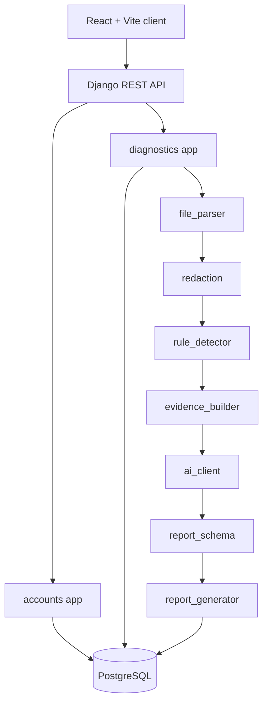

# PatchPath Architecture

> Companion to [AGENT_PLAN.md](AGENT_PLAN.md) (the full build plan). This file is
> the quick architectural orientation for anyone touching the codebase.

## System overview

PatchPath is a two-tier SaaS: a React/Vite SPA talking to a Django REST API
backed by PostgreSQL. AI diagnosis is an **evidence-first** pipeline — deterministic
rule detection and secret redaction run *before* any model call, and all model
output is schema-validated before it is persisted.

## Repository layout

| Path | Purpose |
| --- | --- |
| [`backend/`](../backend) | Django project + DRF API |
| [`backend/config/`](../backend/config) | Settings (split), URLs, WSGI/ASGI, health check |
| [`backend/apps/accounts/`](../backend/apps/accounts) | Custom email user + JWT auth |
| [`backend/apps/diagnostics/`](../backend/apps/diagnostics) | Domain models, API, and the analysis service layer |
| [`frontend/`](../frontend) | React + Vite + TypeScript SPA |
| [`docs/`](.) | Plan, architecture, demo script |
| [`samples/`](../samples) | Safe demo evidence files |
| [`docker-compose.yml`](../docker-compose.yml) | Local orchestration (db + backend + frontend) |

## Backend principles

- **Split settings** (`base` / `development` / `test` / `production`); production
  validates required env at import time.
- **Thin views, fat services** — the analysis pipeline lives in
  `apps/diagnostics/services/`.
- **Custom email user model** from the first migration; UUID PKs on exposed records.
- **Ownership-scoped querysets** on every project/session/report endpoint, with
  object-level permission backstops.
- **Transactions** around analysis so session status and report persistence stay consistent.
- **AI is always mocked in tests.**

## Frontend principles

- Route components compose pages and orchestrate data; reusable pieces live in
  `components/`.
- API calls are isolated in typed client modules (`src/api/`).
- Auth state lives in `AuthContext`; only the JWT tokens touch `localStorage`.
- Independent fetches use `Promise.all`; memoize only genuinely expensive report rendering.

## The analysis pipeline (request → report)

1. `POST /api/sessions/{id}/upload/` — validate + redact + store text artifacts.
2. `POST /api/sessions/{id}/analyze/` (synchronous for MVP):
   1. redact → 2. run rules → persist `DetectedIssue` rows →
   3. build evidence bundle (≤ char budget) → 4. AI call → parse → validate →
   5. apply confidence/evidence guardrails → 6. persist `DiagnosisReport`,
      mark session `completed`.
3. On AI/validation failure: retry once, else mark session `failed` while keeping
   uploaded files and detected issues.

## Current status

This repository now contains the MVP vertical slice: email/JWT auth,
ownership-scoped project/session/report APIs, upload validation and redaction,
deterministic rule detection, evidence-bundle construction, schema-validated AI
report generation, a React diagnostic workflow, and seeded demo data. Remaining
hardening work is mostly operational: broader smoke testing, production deploy
settings, and replacing the synchronous analysis path with background jobs when
the MVP outgrows request/response analysis.
